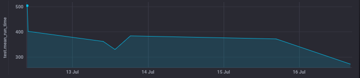

# Оптимизация DX

Я не стал проводить оптимизацию для реальных рабочих проектов по нескольким причинам:
во-первых, работы над проектами строго регламентированы и ничего не делается сверх
контрактных работ, согласованных с заказчиком. Во-вторых, у нас уже есть нечто подобное,
и тесты уже серьезно оптимизированы. Ну, и в-третьих, жесткий NDA все равно не дал бы
продемонстрировать результат работы. Поэтому было решено было оптимизировать dev.to.

Так сложились обстоятельства, что со временем было сложно, приходилось его буквально урывать.
Поэтому получилось не очень последовательно и делалось на двух разных ПК с разной ОС,
однако, все измерения метрик проводились, в итоге, "начисто" на одном из них.

Также не все примененные тут решения я бы применил в реальном проекте, поэтому
они тут носят, скорее, демонстрационный вид, показывающий работу с материалом, но
нуждающийся в улучшении для реального применения.

## Подготовка

Для интеграционных тестов не работал "безголовый" режим, Chrome взлетал
видимым окном. Пришлось поправить свособ инициализации драйвера, в проекте
было расчитано старую передачу опций запуска.

Не все тесты прошли. Один был замечен в использование "старой" даты,
как даты в будующем и был поправлен. Остальные -- фичер-тесты, валятся случайно,
по нескольку штук за проход. Точно помню, было такое уже на одном проекте,
было вызвано некорректной обработкой ожиданий событий браузера внутри Капибары.
Быстро прпавить не получилось, для прохождения всего сьюта включил сохранение
состояния, в повторном прогоне завалившиеся тесты проходят успешно.
Будем при выполнении задания использовать такой подход для проверки успешности.

```
Failed examples:

rspec ./spec/features/comments/user_delete_a_comment_spec.rb:15 # Deleting Comment works
rspec ./spec/features/comments/user_edits_a_comment_spec.rb:22 # Editing A Comment when user edits comment on the bottom of the article updates
rspec ./spec/features/comments/user_edits_a_comment_spec.rb:39 # Editing A Comment when user edits via direct path (no referer) cancels to the article page
```

Установить InfluxDB в виде докер-контейнера также не составило труда, хотя, совсем недавно вышла
2-я версия, которая имеет другой набор инструментов. Не будучи уверенным, что гем Influxer будет
корректно работать со второй версией, установил TICK-стек для первой. Кстати, в Гитхабе он теперь
называется `influxdata/sandbox` (https://github.com/influxdata/sandbox).

Отправку метрик я реализовал предложенным в лекциях способом -- через `influxer`,
чтобы его попробовать. Но я не очень согласен с тем, что хорошо так делать
именно для этой метрики: в проекте, пусть даже в тестовом окружении, появляется
лишняя зависимость, которая нужна только для того, чтобы отправить метрику.
А сама Rake-таска выполняет родь командного скрипта. Все это, чисто в теории,
может сказаться на стабильной работе.

Мое мнение здесь, что в реальной жизни для внешнего вызова (не через команду
`rspec`) оптимальнее использовать shell-скрипт, замеряющий время выполнения тестов
и отправляющий метрику, например, через команду `influx -execute ...`.

Более интересен будет случай, когда целью является сделать отправку метрики
частью обычного процесса разработки, тогда ее отправку надо встроить в вызов
`rspec`, либо заменить `rspec` на свою реализацию. Второй случай больше по
часте сисадминов и девопсов, поэтому я продемонстировал, как применить первый.
Для удобства выполнения именно этого задания отправка метрики просиходит только
при выставлении переменной окружения, но в реальной жизни лучше делать наоборот --
метрика отправляется всегда, но предусмотрено опциональное отключение. Также,
дополнительно имеет смысл, например, делать отправку только для прогона всех тестов.
Понятно, что можно также ввести различные другие метрики и отсылать их, и тогда
включение `influxer`-а в проект уже будет весьма оправдвнным.
Но все это индивидуально, зависит от самого проекта и принятого на нем процесса
разработки, поэтому здесь стоило упомянуть об этом, а конкретную реализацию
оставить для реальных проектов.


## Начальное состояние

Прогон всех тестов занял примерно **505 сек**.

## Профилирование

Попробовав использовать переменную `SAMPLE`, я понял, что она по какой-то причине
не работает, поэтому решено было оптимизировать весь сьют, благо, время на полный
прогон порядка 5 минут оказалось не таким большим в конкретно этом случае.

Прогон всех тестов с включенным ruby-profiler заканчиваается ошибкой выполнения
в интерпретаторе, практически сразу после запуска. Для того, чтобы все-таки
получить такой отчет, решено было обновить Ruby на 2.7 и, в итоге, удалось получить
как работающие тесты, так и улучшение времени выполнения до **403 сек** (-20%).

После обновления, чтобы избавиться от deprecation-ворнингов пришлось
также обновить `json` и `fog`, а также применить небольшой манкипатч.
Уверен, сделать можно было сильно аккуратнее.

После обновления удалось составить отчет `ruby-prof`. Анализируя его
можно заметить, что существенное время выполнения приходится на `backtrace_cleaner`:

```
%self total self wait child calls name location
21.37 277.555 277.552 0.002 0.001 133211 ActiveSupport::BacktraceCleaner#filter_backtrace /Users/dave/.rvm/gems/ruby-2.7.3@rails-optimization-task4/gems/activesupport-5.1.6.2/lib/active_support/backtrace_cleaner.rb:83
8.70 113.050 113.048 0.001 0.000 134478 Kernel#caller
2.28 30.858 29.574 1.282 0.002 116418 PG::Connection#async_exec
1.73 22.467 22.467 0.000 0.000 20101141 String#=~
...
```

Видно, что работает отсев по списку фильтров, поэтому отключаем в нем фильтры.

Получаем время выполнения **321 сек** (еще -20%), и видно, что
`backtract_cleaner` больше не работает:

```
%self      total      self      wait     child     calls  name                           location
12.17    129.980   129.978     0.001     0.001   134228   Kernel#caller
2.37     25.960    25.341     0.617     0.002   116239   PG::Connection#async_exec
2.34     24.967    24.967     0.000     0.000 20073586   String#=~
```

## Логирование

Отключить логирование было бы хорошей идеей, но в `test.rb` видим, что оно уже
отключено.

## Database Cleaner

Отключение Database Cleaner'а на проекте оказалось не так очевидно, как выглядело:
тесты стали падать массово, так как часто используются данные, которые должны
быть уникальными или для проверок используется общее количество записей, а не число
изменившихся в тесте. Попытка отключить клинер везде, но оставить только там, где
он нужен тоже не окзалась особенно успешной. Было решено не использовать в задании
эту оптимизацию как достаточно рисковую, и требующую серьезной дополнительной
работы для получения качественного результата.

Можно сделать вывод, что не всегда просто отключения Database Cleaner будет
достаточно для того, чтобы улучшить DX, понадобится также время на адаптацию
самих тестов, и, возможно, достаточно существенное.

## Аплоад аватарок

Вот, это реально было место, о котором раньше я никогда не задумывался! А в
действительности оказалось, что создается такое огромное количество ненужных,
в общем-то файлов! Поэтому решено было поправить фабрику `factory/users.rb`,
исключив в ней формирование загруженного аватара. Внезапно, оказалось, что
от этого перестала работать всего одна (!) спека.

Загрузка картинки была сделана только для этой спеки.

Получилась метрика в **273 сек**, что на 15% лучше предыдущей.

## Самая медленная спека

Ок, попробуем теперь найти и оптимизировать самую проблемную спеку.

Запускаем `rspec --profile`, по отчету видим, что это
`spec/features/user_views_a_reading_list_spec.rb`:

```
Top 10 slowest examples (52.7 seconds, 11.8% of total time):
  Reading list without tags when large readinglist shows the large reading list
    8.13 seconds ./spec/features/user_views_a_reading_list_spec.rb:20
...
```

Применяем теперь вызов `RD_PROF=1 rspec` для того, чтобы определить время на выполнение
`before`/`let`. Видим, что:

```
Total time: 00:19.438

Total `let` time: 00:01.349
Total `before(:each)` time: 00:15.977

Top 5 slowest suites (by `let` time):

Reading list (./spec/features/user_views_a_reading_list_spec.rb:3) – 00:01.349 of 00:19.438 (4)
 ↳ user – 14
 ↳ article – 1
 ↳ article2 – 1

Top 5 slowest suites (by `before(:each)` time):

Reading list (./spec/features/user_views_a_reading_list_spec.rb:3) – 00:15.977 of 00:19.438 (4)
```

Подключаем `let_it_be` и меняем единственный `let!` на `let_it_be`. `before_all` в этой
спеке подключить некуда, к сожалению. Смотрим, что получилось:

```
Total time: 00:19.433

Total `let` time: 00:01.314
Total `before(:each)` time: 00:15.964

Top 5 slowest suites (by `let` time):

Reading list (./spec/features/user_views_a_reading_list_spec.rb:3) – 00:01.314 of 00:19.433 (4)
 ↳ user – 10
 ↳ article – 1
 ↳ article2 – 1

Top 5 slowest suites (by `before(:each)` time):

Reading list (./spec/features/user_views_a_reading_list_spec.rb:3) – 00:15.964 of 00:19.433 (4)
```

Время выполнения уменьшалось совсем незначительно, но перезамеры показывают, что
все-таки уменьшилось. Применяя такую же оптимизацию ко всем спекам, возможно,
можно получить более ощутимый прирост производительности общего выполнения тестов.


## Итоговый результат

Получаем улучшение метрики **с 505 до 273 секунд**, что составляет **46%**
прироста производительности.

График метрики из Инфлюкса показывает наглядно, как менялась метрика. К сожалению,
шкала ординат тут не способствует удобному восприятию, и вкралась пара неудачных
измерений,но, тем не менее, проделанную работу неплохо видно:


