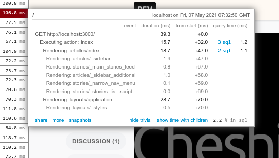
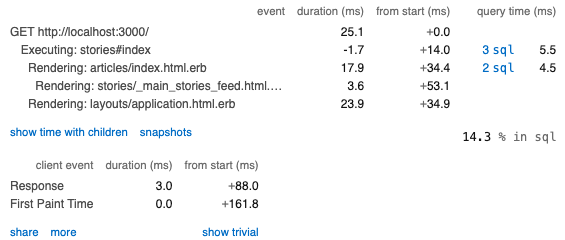

## Case Study

## Подготовка

- Запустил проект `dev.to` локально
- Настроил `NewRelic` для 'development'
- Настроил `local_production` для проекта и подкючил `NewRelic`
- Настроил `rack-mini-profiler` для `local_production` и добавил ключ по которому можно включить профайлер

## Оптимизация

Ввиду сложностей запуска, я строго следовал рекомендация из описания.
NewRelic оказался не очень информативен для понимания причины медленной работы ввиду трейсы из коробки не идентифицируют все трейсы.
`rack-mini-profiler` показал, что `single_story` рендерится многократно и это точка для оптимизации.



Утилита ab показала, что среднее время ответа составляет `675.065 [ms]`

<details>
<summary>ab -n 100 -c 5 127.0.0.1:3000/</summary>

```
This is ApacheBench, Version 2.3 <$Revision: 1903618 $>
Copyright 1996 Adam Twiss, Zeus Technology Ltd, http://www.zeustech.net/
Licensed to The Apache Software Foundation, http://www.apache.org/

Benchmarking 127.0.0.1 (be patient).....done


Server Software:
Server Hostname:        127.0.0.1
Server Port:            3000

Document Path:          /
Document Length:        143403 bytes

Concurrency Level:      5
Time taken for tests:   13.501 seconds
Complete requests:      100
Failed requests:        0
Total transferred:      14382600 bytes
HTML transferred:       14340300 bytes
Requests per second:    7.41 [#/sec] (mean)
Time per request:       675.065 [ms] (mean)
Time per request:       135.013 [ms] (mean, across all concurrent requests)
Transfer rate:          1040.31 [Kbytes/sec] received

Connection Times (ms)
              min  mean[+/-sd] median   max
Connect:        0    0   0.5      0       4
Processing:   108  631 1067.2    377    5300
Waiting:      107  624 1066.9    373    5297
Total:        109  631 1067.2    378    5300

Percentage of the requests served within a certain time (ms)
  50%    378
  66%    405
  75%    440
  80%    459
  90%    520
  95%   5153
  98%   5285
  99%   5300
 100%   5300 (longest request)
```

</details>

После добавления кэширования в метод `single_story` среднее время ответа составило `133.472 [ms]`
и `rack-mini-profiler` показал, что `single_story` рендерится один раз.


<details>
<summary>ab -n 100 -c 5 127.0.0.1:3000/</summary>

```
This is ApacheBench, Version 2.3 <$Revision: 1903618 $>
Copyright 1996 Adam Twiss, Zeus Technology Ltd, http://www.zeustech.net/
Licensed to The Apache Software Foundation, http://www.apache.org/

Benchmarking 127.0.0.1 (be patient).....done


Server Software:
Server Hostname:        127.0.0.1
Server Port:            3000

Document Path:          /
Document Length:        143451 bytes

Concurrency Level:      5
Time taken for tests:   2.669 seconds
Complete requests:      100
Failed requests:        0
Total transferred:      14387400 bytes
HTML transferred:       14345100 bytes
Requests per second:    37.46 [#/sec] (mean)
Time per request:       133.472 [ms] (mean)
Time per request:       26.694 [ms] (mean, across all concurrent requests)
Transfer rate:          5263.34 [Kbytes/sec] received

Connection Times (ms)
              min  mean[+/-sd] median   max
Connect:        0    0   0.2      0       1
Processing:    68  124  26.5    115     206
Waiting:       66  122  26.1    112     205
Total:         68  125  26.5    116     206

Percentage of the requests served within a certain time (ms)
  50%    116
  66%    135
  75%    143
  80%    146
  90%    157
  95%    175
  98%    198
  99%    206
 100%    206 (longest request)
```

</details>

Таким образом, после оптимизации среднее время ответа уменьшилось в 5 раз.
