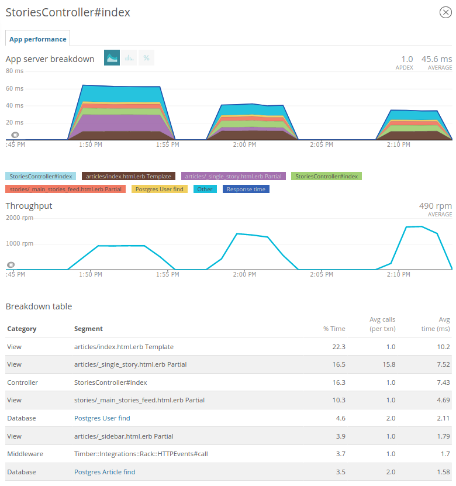

## Задание 4

### Подготовка

1. проект запущен локально
1. настроен new_relic, skylight, algolia, rack_mini_profiler
1. сделана возможность запуска проекта в local_production

### Задача

Ускорение загрузки главной страницы

#### Начальные данные

```
ab -n 50 http://localhost:3000/

Time taken for tests:   2.795 seconds
```

В качестве метрики использую время выполнения 2.795 секунд

#### Фидбек-loop

1. анализ отчетов профайлеров в поисках точки роста
1. рефакторинг
1. замер метрики командой ab
1. анализ изменений выбранного отчета профалера

#### Находка №1

- new_relic показал, что 29% времени рендерится Partial articles/\_single_story.html.erb
- кешировать паршиал для каждой истории с учетом связанных моделей
- метрика уменьшилась до 1,7 секунд
- articles/\_single_story.html.erb пропал из топа

### Итог

С помошью инструментов внешних удалось выявить наиболее узкие места отображения страницы.
Удалось улучшить скорость загрузки основной страницы.

На скриншоте 3 графика:

1. до оптимизации
1. с кешированием в паршиале
1. с кешировонием в вызывающем вью/паршиале
   

#### Прочие итоги и впечатление

1. В проекте уже довольно интенсивно применяется кеширование, из-за чего исследование затрудено, а время загрузки индексной страницы меняется в широком диапазоне - от 0.5 до 2,5 секунд.
1. Для проверки корректности использования кеширования правильно использовать автотесты, их нет.
1. В целом проекту нужен рефакторинг: очень длинные файлы моделей, декораторы применяются, но недостаточно.
1. Есть еще места для оптимизации (например, кеширование тегов), но их результативность оценить слабореально.
1. Совершенно не понравилась организация файла routes.rb. Также во время запроса страницы неоднакратно в логах появляется ошибка ActionController::RoutingError.

#### Отчет ab

```
ab -n 5000 http://localhost:3000/
```

Исходный код

```
   Concurrency Level:      1
   Time taken for tests:   323.844 seconds
   Complete requests:      5000
   Failed requests:        0
   Total transferred:      676169112 bytes
   HTML transferred:       674055000 bytes
   Requests per second:    15.44 [#/sec] (mean)
   Time per request:       64.769 [ms] (mean)
   Time per request:       64.769 [ms] (mean, across all concurrent requests)
   Transfer rate:          2039.01 [Kbytes/sec] received

   Connection Times (ms)
                 min  mean[+/-sd] median   max
   Connect:        0    0   0.0      0       0
   Processing:    48   65  24.9     59    1006
   Waiting:       48   64  24.8     58    1005
   Total:         48   65  24.9     59    1006

   Percentage of the requests served within a certain time (ms)
     50%     59
     66%     61
     75%     63
     80%     66
     90%     91
     95%     96
     98%    123
     99%    133
    100%   1006 (longest request)
```

С кеширвоанием

```
Concurrency Level:      1
Time taken for tests:   179.929 seconds
Complete requests:      5000
Failed requests:        0
Total transferred:      676168896 bytes
HTML transferred:       674055000 bytes
Requests per second:    27.79 [#/sec] (mean)
Time per request:       35.986 [ms] (mean)
Time per request:       35.986 [ms] (mean, across all concurrent requests)
Transfer rate:          3669.90 [Kbytes/sec] received

Connection Times (ms)
              min  mean[+/-sd] median   max
Connect:        0    0   0.0      0       0
Processing:    26   36  21.6     32     973
Waiting:       26   35  21.4     31     972
Total:         26   36  21.6     32     973

Percentage of the requests served within a certain time (ms)
  50%     32
  66%     34
  75%     36
  80%     37
  90%     46
  95%     65
  98%     73
  99%     77
 100%    973 (longest request)
```
