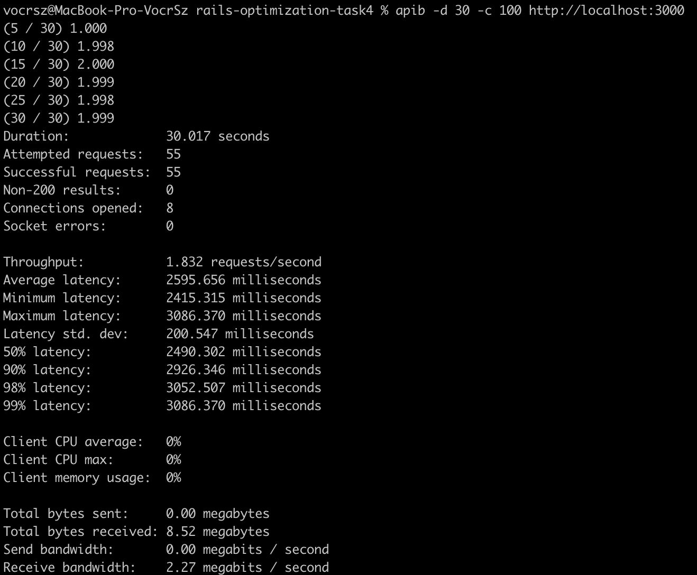
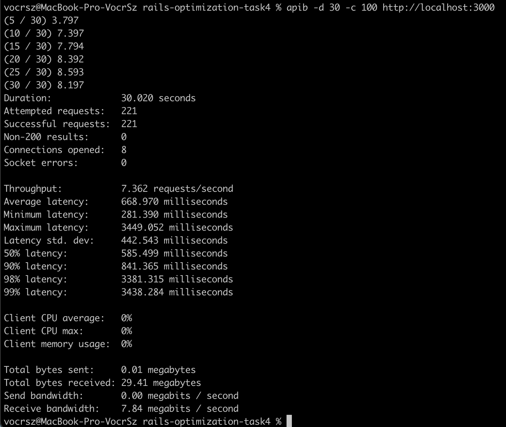
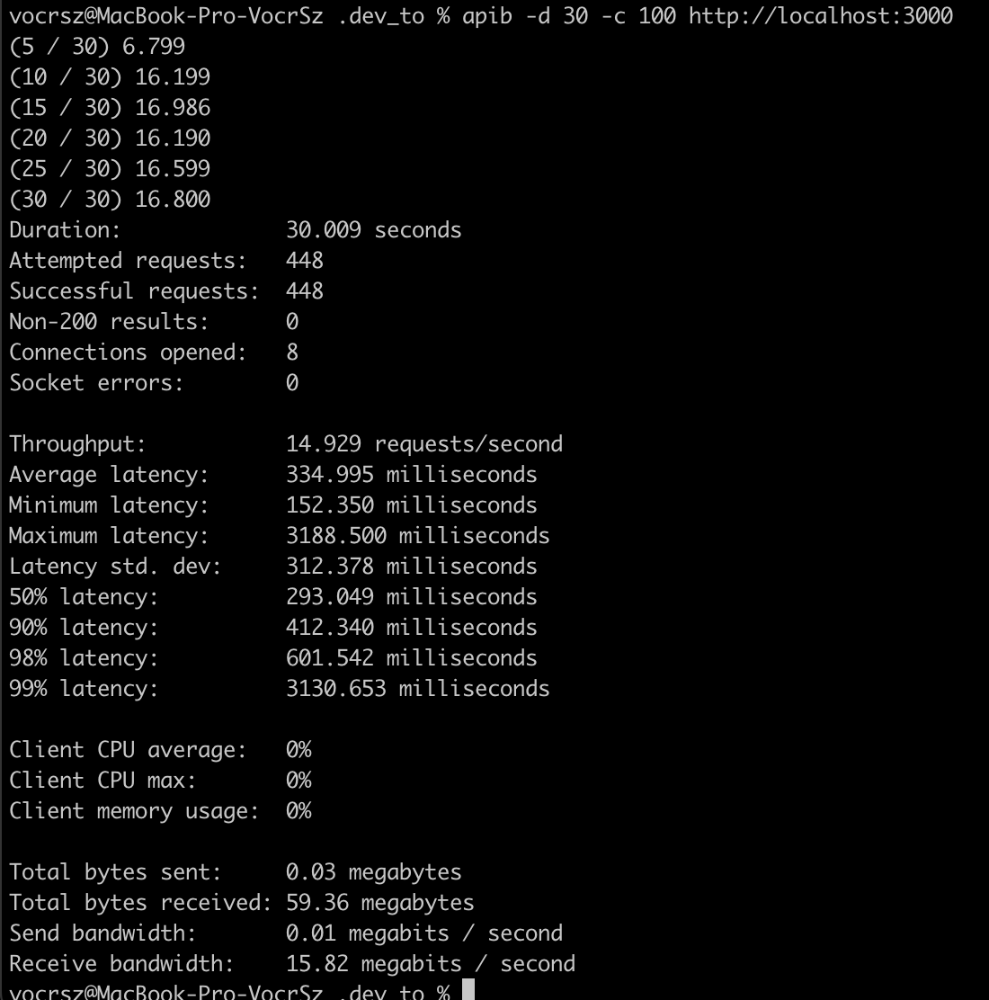
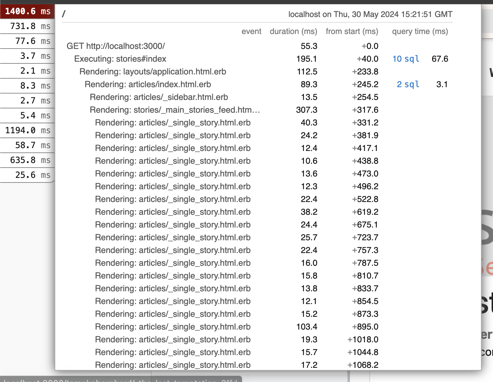
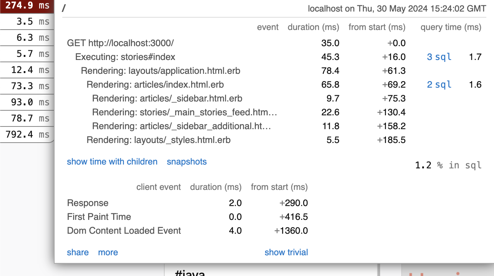
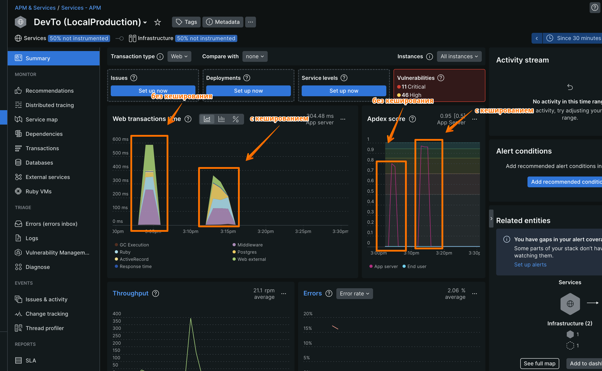

# Case-study оптимизации 4

- [Case-study оптимизации 4](#case-study-оптимизации-4)
  - [Актуальная проблема](#актуальная-проблема)
    - [apib для developemnt режима](#apib-для-developemnt-режима)
    - [apib для localprod режима](#apib-для-localprod-режима)
    - [apib для localprod режима после кеширования](#apib-для-localprod-режима-после-кеширования)
    - [rack-mini-profiler без кеширования](#rack-mini-profiler-без-кеширования)
    - [rack-mini-profiler с кешированием](#rack-mini-profiler-с-кешированием)
    - [newrelic результаты](#newrelic-результаты)

## Актуальная проблема

Видим, что главная страница грузится медленно
Установим newrelic-rpm, skylight и посмотрим их дашборды
Поднимем окружение localprod (local_production мы не смогли завести, потому что skylight не работает с underscore в названиях окружений), максимально приближенное к production
Установим для него следующие параметры, отличные от development
- `cache_classes: true`
- `eager_load: true`
- `perform_caching: true`
- `assets_debug: false`
- `assets_compile: false`
Поставим гем 'rack-mini-profiler', который не заведется для localprod и попробуем посмотреть на главную страницу в development режиме.
Видим много строчек, говорящих нам о том, что долго рендрятся stories паршалы
Добавим кеширование для блока, отвечающего за статьи
В результате видим ускорение.
Запустим apib для нагрузочного тестирования, видим прирост производилеьности примерно в 2 раза

### apib для developemnt режима

### apib для localprod режима

### apib для localprod режима после кеширования

### rack-mini-profiler без кеширования

### rack-mini-profiler с кешированием

### newrelic результаты

